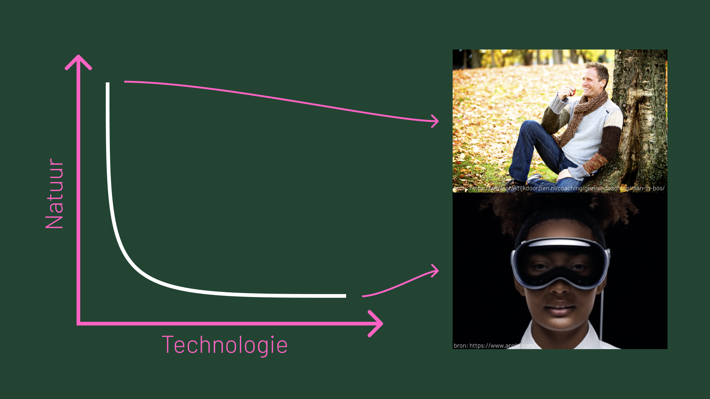

# 🕊 Betrokken

> Je reflecteert kritisch en inhoudelijk op je persoonlijke ontwikkelingen. Waar mogelijk beschrijf je het multidisciplinaire aspect en de doorgemaakte ontwikkeling en verbetermogelijkheden. Je neemt hierin de feedback van teamleden mee.

## <mark style="color:green;">Peerfeedback</mark>

Doordat we maar één keer een peerfeedback ronde hadden (erna zijn we dus gesplitst) heb ik maar één keer schrijftelijke feedback gekregen. De mondelinge feedback die ik daarna heb gekregen beschrijf ik in het kopje hieronder.

De meest prominente feedback is mijn communicatie. Ik kan niet enorm goed overweg met Teams waardoor ik zo nu en dan berichten over het hoofd zag. We hebben expres gekozen voor dit communicatie middel, omdat iedereen hier het meeste me om kan gaan. Na deze feedback heb ik mijn best gedaan om de chat beter in de gaten te houden en regelmatig terug te lezen zodat ik zeker weet dat ik geen berichten vergeten was.

Een ander stukje feedback die ik heb gekregen is dat ik stil was. De gene die deze feedback heeft gegeven heb ik al vaker mee in het team gezeten en daar was ik over het algemeen de scrummaster/team captain. In dit team had Isa deze taak op zich genomen waardoor relatief gezien stiller was. Ik heb deze feedback alsnog meegenomen en heb geprobeerd wat meer van mezelf te laten horen verder in het project.

<figure><figcaption>
Feedback van teamgenoten via <a href="https://www.figma.com/file/9CwRcO8mnUqR1hZJ9WJZte/&#x27;Miroboard&#x27;-DC8%2F-ML2?type=whiteboard&#x26;node-id=0%3A1&#x26;t=LKWDipqMsV5ikgY0-1">figjam</a>
</figcaption></figure>

Verder heb ik mondeling ook veel feedback gekregen. De dag voor de prototype party was iedereen druk bezig met berichten sturen in Teams, en ik vergat op één iemand te antwoorden die heel duidelijk liet merken dat die gene er erg gefrustreerd over was. Ik schrok een beetje van dit bericht en heb het even gelaten voor wat het was. Later op de dag had ik terug gechat dat het niet handig van mij was dat ik het berichtje niet had gezien, maar wel gevraagd of die gene het de volgende keer anders zou kunnen aangeven. Deze persoon is later naar me toe gekomen om te zeggen dat dit een professionele manier was van het oplossen van het probleem.

Ik heb verder ook veel positieve feedback gekregen over de input die ik heb geleverd. De wireframe die ik heb gemaakt zag er sterk uit, de visuals voor de eindpresentatie waren pakkend, het resultaat van de raspberry vond mijn team gaaf en de inzichten die ik zo stevig vasthield over outcome en impact waren heel slim.

## <mark style="color:green;">Splitsing</mark>

Het zal raar klinken, maar ik ben er dankbaar voor dat het team is gesplitst. Ik was lekker bezig om met de CMDers verder te werken aan het onderzoek en het testen van de wireframes. De splitsing heeft er uiteindelijk voor gezorgd dat ik me bezig ben gaan houden met de competenties, en bezig ben geweest met coderen. In het vervolg is het beter als ik tijdens het project meer naar het beoordelingsformulier ga kijken zodat ik zeker weet dat ik genoeg doe om het vak te halen, in plaats van alleen achter mijn interesses aan te gaan.

## <mark style="color:green;">Positiviteit</mark>

Een van mijn specialiteiten is negatieve gedachtes om te zetten in positieve. De opdracht voor dit project was nogal ingewikkeld: iets met AR/VR/immersive maken wat mens en natuur dichter bij elkaar brengt. Als je iets AR/VR maakt breng je de mens alleen maar verder van natuur af, en in iets natuurlijks zit geen technologie. Dit was tevens ook een argument om geen AR/VR te gebruiken in het concept. Ondanks deze uitdaging heb ik mijn team steeds goede hoop toe gepraat. Dit heeft er denk ik wel voor gezorgd dat mijn team beter ging presteren, ook al was de invloed minimaal.

<figure><figcaption>
"Geen techniek is persoon met appel, geen natuur is apple bril, enige connectie is apple, een leuke uitdaging dus!"
</figcaption></figure>

## <mark style="color:green;">CMD</mark>

Ik heb me dus tijdens het project gefocust op het leren van de werkwijzes van CMD. Van Paulina en Isa kreeg ik regelmatig de feedback dat ik best wel een CMD mindset heb. Ik vind dit hele waardevolle feedback, want met dit project ben ik erachter gekomen dat ik het onderzoeksproces eigenlijk ook heel interessant vind. Op CMD hebben ze veel meer verschillende methodes om het proces te doorlopen. Voorafgaand aan dit project was ik er van overtuigd dat ik alleen het prototype proces het leukst vond, maar dat is dus niet zo.

## <mark style="color:green;">Reflectie</mark>

<table data-card-size="large" data-column-title-hidden data-view="cards"><thead><tr><th></th><th></th><th data-hidden></th></tr></thead><tbody><tr><td><strong>Wat ging er goed?</strong></td><td>Door mijn positieve insteek heb ik er voor kunnen zorgen dat mijn team ook veel positiever naar de opdracht is gaan kijken.</td><td></td></tr><tr><td><strong>Wat kon er beter?</strong></td><td>Ik verloor de competenties uit het oog, waardoor de splitsing van de groep er voor heeft gezorgd dat ik er uiteindelijk wel bezig geweest ben met ontwikkelen. Hier had ik beter op kunnen letten.</td><td></td></tr><tr><td><strong>Wat zou ik in het vervolg anders doen?</strong></td><td>Doordat ik bezig was met luisteren en leren van de CMD methodes, was ik wat stiller. In het vervolg wil ik op deze momenten meer input leveren zodat ik niet 'stil' lijk.</td><td></td></tr><tr><td><strong>Wat heb ik geleerd?</strong></td><td>Dat ik prima overweg kan met de CMD studenten en hun methodes en dat ik me ook best wel thuis voel binnen hun werkwijzes en gedachtegangen.</td><td></td></tr></tbody></table>
