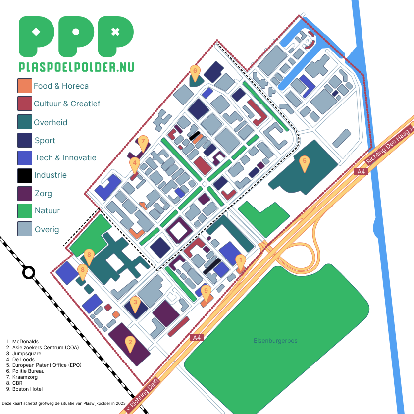

# 🐤 Onderzoekend

> Je identificeert technologische trends en ontwikkelingen en vertaalt deze naar uitgangspunten die je hanteert tijdens het realisatieproces.

## <mark style="color:green;">CCMDGT</mark>

Communicative and Creative MultiMedia Design and Game Technologies, zo voelde het afgelopen project voor mij. Als ik de opleidingen CMGT en CMD met elkaar vergelijk, is CMD vooral gefocust op het onderzoeken, ontwerpen en het onderbouwen van alle keuzes, terwijl CMGT veel meer is gericht op het ontwikkelen van een product. Omdat wij als CMGT zowel onderzoeken, ontwerpen als ontwikkelen, vond ik het een heel geschikt moment om goed mee te kijken bij de processen van CMD. Dat is me zelfs tot een bepaald niveau gelukt dat ik zelfs nuttige input kon leveren.

Ergens in het begin van het project hebben we vanaf Den Haag Centraal, door het duinlandschap gefiets naar Meijendel. Daar kregen we een rondleiding van 'de boswachter'. Tussendoor heb ik verschillende vragen gesteld over de natuur en hoe ze bepaalde problemen oplosten. Dit gaf natuurlijk meer inzichten en kennis over de natuur.

Na de fietstocht heb ik met Isa en Paulina in de bibliotheek de informatie gebundeld en zijn we bezig geweest met onderzoeksvragen en ontwerprichtlijnen opstellen. Zo heb ik me bezig gehouden met vragen stellen zoals "Waarom zouden bedrijven willen investeren?". Dit soort vragen hebben ons geholpen om het grote probleem op te splitsen in kleine stukjes welke we behapbaar konden onderzoeken en een oplossing voor konden vinden. De ontwerprichtlijnen die uit deze meeting zijn gekomen zijn als volgt:

* Realiseerbaar&#x20;
* Maak het niet te groot (we hebben helaas weinig tijd)
* Toekomst bestendig (veel bedrijven en stukken terrein zullen op korte termijn, verbouwd of gesloopt etc worden. dit maakt ontwerpen natuurlijk extra uitdagend)
* Oplossing moet meebewegen (omdat de toekomst van de terreinen zo onzeker is)

De richtlijnen zijn tijdens het proces vaak aangepast, gezien uitkomsten van nieuwe onderzoeken voor nieuwe inzichten zorgden. Bij het brainstormen hebben we ons gericht op deze richtlijnen zodat deze aan de behoeftes van de opdracht en doelgroep zouden voldoen.

<figure><figcaption>
Fietstocht naar Meijendel
</figcaption></figure>

 

<figure><figcaption>
Werken in de bieb
</figcaption></figure>

## <mark style="color:green;">Demografie (plattegrond)</mark>

Ik kreeg de taak om onderzoek te doen naar het bedrijventerrein. Om het overzichtelijk te houden heb ik het aangepakt door de verschillende onderwerpen te categoriseren. Het eerste waar ik naar opzoek ben gegaan is al het groen wat er al is. Dit is heel simpel: Google Maps. Zoals elk bedrijventerrein is de Plaspoelpolder (het gekozen bedrijventerrein) karig qua hoeveelheid groen. Midden op het terrein zijn er 2 groenstroken in een plus-vorm (het assenkruis). Verder is er een park bovenop een parkeerplaats en een grasveld wat onderdeel is van een overheidsgebouw. Gelegen buiten het bedrijventerrein ligt het Elsenburgerbos wat vanaf het uiterste puntje bedrijventerrein in 10 minuten fietsen te bereiken is.

De tweede categorie is bedrijven en gebouwen, hier zijn er gelukkig genoeg van (duh). Ik heb van google maps alle gebouwen overgetrokken om kleuren te koppelen aan de verschillende disciplines. Het terrein is enorm divers, wat te zien is doordat er niet één prominente kleur zichtbaar is. De informatie heb ik vergaard door op Google Maps de websites van de bedrijven te bekijken. Een groot nadeel is wel dat er veel bedrijven samen in één gebouw zitten, waardoor ik de ze heb moeten indelen bij 'overig' om zo min mogelijk foutieve informatie op de kaart te zetten.

Erna kwam de categorie OV en berijkbaarheid. Er rijdt een tramroute dwars door het gebied met in totaal 3 haltes en een busroute die op 4 locaties stopt. Vlak naast het terrein is het treinstation Rijswijk welke ook OV fietsen verhuurt. Qua bereikbaarheid met de auto ligt het bedrijventerrein vlak pal naast de A4 mét afslag speciaal voor de plaspoelpolder. Parkeergelegenheden zijn er genoeg maar zijn over het algemeen wel in bezit van bedrijven zelf. Het terrein is dus betreft berijkbaarheid enorm aantrekkelijk.

Als laatste ben ik opzoek gegaan naar al bestaande info. Het meest prominente wat ik ben tegengekomen is een [verslag](https://api1.ibabs.eu/publicdownload.aspx?site=rijswijk\&id=100156431) (let op, downloadt meteen!) die de toekomstvisie beschrijft. Erin staat beschreven dat ze het assenkruis (de groenstroken) willen doorontwikkelen voor ontspanning en aan de noordzijde kantoren en wonen willen mengen.

<figure><figcaption>
Nieuwe visiekaart Plaspoelpolder bron: <a href="https://api1.ibabs.eu/publicdownload.aspx?site=rijswijk&#x26;id=100156431">https://api1.ibabs.eu/publicdownload.aspx?site=rijswijk&#x26;id=100156431</a>
</figcaption></figure>

Al deze informatie heb ik samengevoegd (met uitzondering van de bestaande visualisaties) door een grote kaart te maken en de verschillende disciplines en categorieën een kleur te geven. Daarnaast heb ik grote invloedrijke gebouwen en bedrijven een nummer gegeven zodat de kaart meer context zou geven over de sfeer.

<figure><figcaption>
Plaspoelpolder plattegrond via <a href="https://www.figma.com/file/9CwRcO8mnUqR1hZJ9WJZte/&#x27;Miroboard&#x27;-DC8%2F-ML2?type=whiteboard&#x26;node-id=0%3A1&#x26;t=LKWDipqMsV5ikgY0-1">figjam</a>
</figcaption></figure>

## <mark style="color:green;">AR/VR</mark>

De opdracht voor dit project bevat AR en VR. Ik heb hier voorafgaand aan het project geen onderzoek naar gedaan, wat ik wel had moeten doen. Teamgenoot Quinty was er heel erg van overtuigd dat ze absoluut niets met dat onderwerp wilde doen omdat ze er met een eerder project moeite mee had. Ik stond daar juist tegengesteld in: ik heb moeite gehad met een AR project en wilde juist dat onderwerp verwerken in het project. Helaas hadden we wel moeite om iets met AR/VR te doen wat er ook voor zou zorgen dat de mens meer naar natuur zou brengen.

Desondanks die uitdaging heb ik na de tussenpresentatie onderzoek gedaan naar deze technologie. Een van de betrokkenen zag een kans om een app te maken om mensen te laten zien hoe het bedrijventerrein er uit zou komen te zien als er meer vergroening zou plaatsvinden en op deze manier mensen te enthousiasmeren. Daarover beschrijf ik meer over [bij het hoofdstuk 'Rob'](ontwerpend.md#rob).

Over het algemeen staat Unity bekend om een AR of VR applicatie te maken, maar gezien ik hier slechte herinneringen aan heb ben ik opzoek gegaan naar een andere mogelijkheid. Tussen mijn vorige AR project en nu heb ik veel geleerd over C# en Unity, maar toch probeer ik het te ontwijken gezien het veel meer tijd en energie kost om mee te werken.

De andere mogelijkheid die ik heb gevonden is WebXR. Dit werkt met HTML en JavaScript en kan alleen op mobieltjes gebruikt worden die de AR techniek support (denk aan camera en 'movement' sensoren). Een aantal websites online bieden demo's die laten zien hoe het eindresultaat eruit ziet. WebXR werkt door middel van ThreeJS waar ik al genoeg ervaring mee heb.

Later hebben we alsnog besloten deze techniek niet te gebruiken gezien het veel meer extra tijd zou kosten om na de tussenpresentatie van concept te veranderen. Daarnaast blijkt dat er al genoeg applicaties bestaan die doen wat de betrokkenen voor ogen had.

## <mark style="color:green;">Interview</mark>

Om met de doelgroep in contact te komen ben ik op mijn werk gaan vragen of ik iemand kon interviewen. Het geluk had ik, één persoon had tussendoor de tijd om een aantal vragen te beantwoorden.

<figure><figcaption>
Interview via <a href="https://www.figma.com/file/9CwRcO8mnUqR1hZJ9WJZte/&#x27;Miroboard&#x27;-DC8%2F-ML2?type=whiteboard&#x26;node-id=0%3A1&#x26;t=LKWDipqMsV5ikgY0-1">figjam</a>
</figcaption></figure>

## <mark style="color:green;">Reflectie</mark>

<table data-card-size="large" data-column-title-hidden data-view="cards"><thead><tr><th></th><th></th><th data-hidden></th></tr></thead><tbody><tr><td><strong>Wat ging er goed?</strong></td><td>Ik heb veel kunnen bijdragen aan het onderzoek door de plattegrond te maken. Hier zijn veel inzichten naar voren gekomen over het bedrijventerrein welke we later in het proces konden gebruiken.</td><td></td></tr><tr><td><strong>Wat kon er beter?</strong></td><td>Ik had bepaalde onderzoeken eerder in het proces kunnen doen zodat we de techniek WebXR al konden meenemen bij de brainstormsessies en er dus ook concepten voor konden bedenken.</td><td></td></tr><tr><td><strong>Wat zou ik in het vervolg anders doen?</strong></td><td>Zoals te zien is aan deze competentie heb ik veel onderzoek gedaan maar qua techniek alleen aan WebXR gewerkt. Ik had me meer kunnen focussen op zoeken naar verschillende technieken.</td><td></td></tr><tr><td><strong>Wat heb ik geleerd?</strong></td><td>Door me te focussen op de CMD methodieken heb ik geleerd dat ik al heel wat goede onderzoeks instincten in me heb zitten die gezorgd hebben voor vragen welke we konden beantwoorden.</td><td></td></tr></tbody></table>
