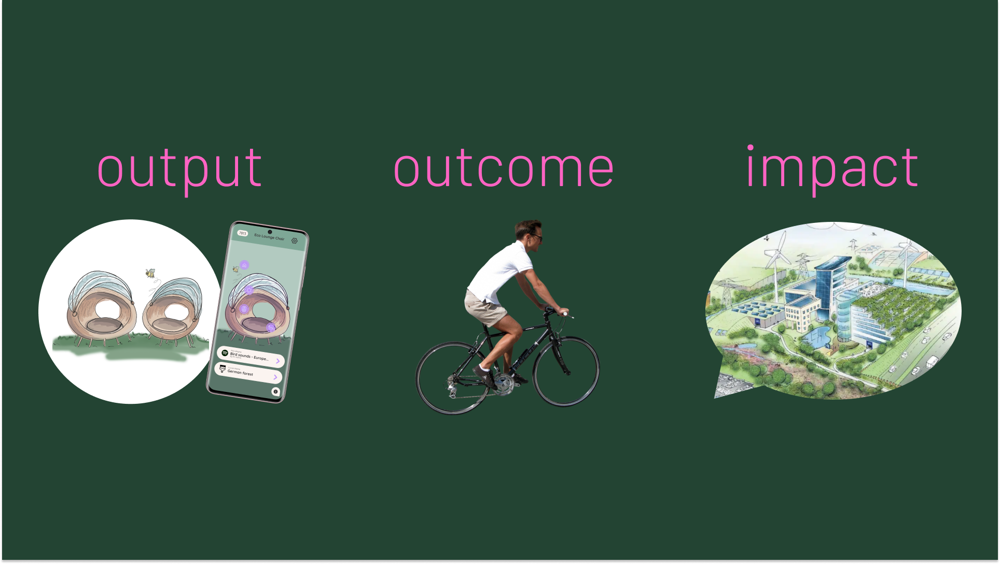

# 🐓 Ontwerpend

> Je identificeert binnen een gegeven vraagstuk samen met partners en opdrachtgevers een breed scala aan mogelijkheden en komt tot 1 concept.

## <mark style="color:green;">Opwarmertje</mark>

Voordat we begonnen aan een brainstormsessie hebben we ons creatieve deel van ons brein geactiveerd door middel van opwarmertjes. Een methode die mij bij is gebleven is het scheuren van een olifant uit een papiertje, maar dan achter je rug. Dit gaf hele leuke outputs en heeft misschien ook wel geholpen met het brainstormproces.

<figure><figcaption>
Opwarmertje olifant scheuren
</figcaption></figure>

## <mark style="color:green;">Brainstorm sessies</mark>

Tijdens het project hebben we heel wat gebrainstormed. Aangezien we dit allemaal in teamverband hebben gedaan zal ik mijn best doen om te documenteren wat mijn bijdrage is geweest.

**Doelgroep**\
Dit is niet echt een methode, maar was wel heel hard nodig. Wat later in het proces hadden we nog geen gerichte doelgroep, dus zijn we 'live' door sticky notes op de muur te plakken bezig geweest. Door de digitalisering lijkt het alsof Quinty alles heeft gedaan, maar op het moment zelf was ik heel actief bezig met mezelf in de doelgroep te verplaatsen en te bedenken wat hun behoeftes zouden kunnen zijn. Omdat dit al best ver in het project was en we nogsteeds geen concept hadden of überhaupt een concept richting heb ik op dit moment gepushed dat we op basis van deze inzichten alvast een aantal ideeën hadden gevormd. Deze zijn in het oranje onderaan te vinden.

<figure><figcaption>
Ideevorming: doelgroep via <a href="https://www.figma.com/file/9CwRcO8mnUqR1hZJ9WJZte/&#x27;Miroboard&#x27;-DC8%2F-ML2?type=whiteboard&#x26;node-id=0%3A1&#x26;t=LKWDipqMsV5ikgY0-1">figjam</a>
</figcaption></figure>

**Brainwriting**\
Dit is een hele leuke leuke brainstorm methode, en werkt als volgt: Iedereen begint met één idee en schrijft deze in de bovenste rij op. Erna volgen 4 rondes waarin we het originele idee van de anderen aanvullen. Tijdens deze methode hebben we de ontwerprichtlijnen bij gehouden zodat de ideeën al de goede richting in gaan. Uit deze brainstorm methode hebben we de 'mobiele werkplek' gevormd, wat later de Eco Launge Chair is geworden.

<figure><figcaption>
Ideevorming: brainwriting via <a href="https://www.figma.com/file/9CwRcO8mnUqR1hZJ9WJZte/&#x27;Miroboard&#x27;-DC8%2F-ML2?type=whiteboard&#x26;node-id=0%3A1&#x26;t=LKWDipqMsV5ikgY0-1">figjam</a>
</figcaption></figure>

**Rapid ideation**\
Deze methode is binnen CMGT wel bekend: binnen x tijd zo veel mogelijk ideeën bedenken. Het contrast tussen deze methode en brainwriting is dat we hier volledig los mochten gaan en niet hoefden te focussen op de ontwerprichtlijnen. Ik merkte met deze methode wel dat het me minder goed lukte om op ideeën te komen. Het kan komen doordat er 'te veel vrijheid' was op deze manier, of omdat ik simpelweg mijn dag niet had. Na de ideation zijn alle ideeën in een COCD box geplaatst, heeft ieder van het team gestemd op de beste ideeën wat zorgde voor 3 ideeën, welke we met de Harris Profile hebben geanalyseerd in hoeverre ze binnen de ontwerprichtlijnen passen.

<figure><figcaption>
Ideevorming: rapid ideation via <a href="https://www.figma.com/file/9CwRcO8mnUqR1hZJ9WJZte/&#x27;Miroboard&#x27;-DC8%2F-ML2?type=whiteboard&#x26;node-id=0%3A1&#x26;t=LKWDipqMsV5ikgY0-1">figjam</a>
</figcaption></figure>

<figure><figcaption>
COCD-box via <a href="https://www.figma.com/file/9CwRcO8mnUqR1hZJ9WJZte/&#x27;Miroboard&#x27;-DC8%2F-ML2?type=whiteboard&#x26;node-id=0%3A1&#x26;t=LKWDipqMsV5ikgY0-1">figjam</a>
</figcaption></figure>

<figure><figcaption>
Harris Profile via <a href="https://www.figma.com/file/9CwRcO8mnUqR1hZJ9WJZte/&#x27;Miroboard&#x27;-DC8%2F-ML2?type=whiteboard&#x26;node-id=0%3A1&#x26;t=LKWDipqMsV5ikgY0-1">figjam</a>
</figcaption></figure>

**Concept visualisaties**\
Nu er 3 ideeën zijn voor concepten zijn we deze meer gaan uitdenken. Hiervoor hebben we per conceptidee plaatjes opgezocht die onze visie representeren. Op dit moment ben ik erachter gekomen dat mijn visie voor de concepten volledig anders was dan mijn teamgenoten, wat een kleine eye-opener was. Mijn taak was om het 'recreatieplein' verder uit te denken. Hiervoor heb ik een beschrijving gemaakt en een tekening op basis van de technieken van [Urban Sketching](ontwerpend.md#urban-sketching).

<figure><figcaption>
Concept visualisatie via <a href="https://www.figma.com/file/9CwRcO8mnUqR1hZJ9WJZte/&#x27;Miroboard&#x27;-DC8%2F-ML2?type=whiteboard&#x26;node-id=0%3A1&#x26;t=LKWDipqMsV5ikgY0-1">figjam</a>
</figcaption></figure>

<figure><figcaption>
Concept beschrijving via <a href="https://www.figma.com/file/9CwRcO8mnUqR1hZJ9WJZte/&#x27;Miroboard&#x27;-DC8%2F-ML2?type=whiteboard&#x26;node-id=0%3A1&#x26;t=LKWDipqMsV5ikgY0-1">figjam</a>
</figcaption></figure>

Ik heb tijdens het ontwerp/ideate proces heel erg gemerkt dat ik het lastig vond om mijn motivatie en aandacht erbij te houden. Mijn vermoeden is dat het komt door de onduidelijkheid, wat ook veel energie kost. Desondanks heb ik mijn uiterste best gedaan om tijdens meetings en het zelfstandig werken zo veel mogelijk dingen voor het project te doen.

## <mark style="color:green;">Urban Sketching</mark>

Vanuit de CMD opleiding werden er wekelijks cursussen aangeboden. Één van de eerste was Urban Sketching, wat mij wel aansprak. Als enige CMGTer heb ik deze cursus gevolgd en heel erg van genoten. Ik vind het sowieso altijd tof als ik mijn visuele gedachtes op papier kan brengen, en met deze cursus heb ik een aantal extra handvaten gekregen

We kregen verschillende oefeningen om de techniek onder de knie te krijgen. Als opwarmertje (CMD warmt vaak op ofzo) de gene tegenover je na tekenen met één lijn zonder te kijken wat je tekent. Erna kregen we een filmpje van dat er veel mensen voorbij liepen, en zo moesten we snel verschillende prominente stukjes eruit halen en tekenen. Als laatste zijn we naar buiten gegaan om in de stad zelf tekeningen te maken.

Wat ik hieraan heb opgestoken en in hoeverre dit relateert aan het project, is simpel: door de omgeving te tekenen ga je op een hele andere manier naar gebouwen, bomen, enzovoort kijken. In relatie tot het project betekend dat ik dus ook op een andere manier kijk naar een bedrijventerrein.

<figure><figcaption>
Urban sketch Gouda
</figcaption></figure>

 

<figure><figcaption>
Urban sketch Rotterdam
</figcaption></figure>

## <mark style="color:green;">Rob</mark>

Halverwegen het project was de tussenpresentatie, waar we vertelden over het onderzoek en de 3 concepten. Na de presentatie konden de geïnteresseerden bij ons team langskomen voor meer informatie. Zo kwamen er verschillende mensenhun inzichten delen. Dit gaf meteen de realisatie dat er buiten de opdrachtgevers veel meer mensen met dit onderwerp bezig zijn.&#x20;

Een van de geïnteresseerden was Rob de Wit, werkende bij Provincie Zuid-Holland. Hij had een hele specifieke visie voor een manier om de toekomstplannen voor bedrijventerreinen te presenteren, namelijk een AR app die het vergroende bedrijventerrein zou laten zien. Dit zou vervangend zijn voor statische tekeningen die de betrokkenen veel minder inleving zou zorgen.

De gedachte hierachter is namelijk dat die theoretische AR app de betrokkenen zou enthousiasmeren over nieuwe plannen. Ze kunnen ermee om zich heen kijken, de omgeving bijna aanraken en zich zo beter kunnen voorstellen wat het resultaat zou worden. Dit inzicht liet een lampje boven mijn hoofd branden: een concept die een indirecte impact heeft.

We hebben uiteindelijk gekozen om toch verder te gaan met de stoel. Om al het onderzoek het raam uit te gooien en een AR app te maken zou zonde zijn en alleen maar meer tijd kosten. Ik hield het inzicht over een indirecte impact bij me, de stoel zou namelijk hetzelfde kunnen doen: mensen laten proeven hoe fijn de natuur is door geur, lampen, comfortabele stoel, waardoor ze het besluit nemen 10 minuten te fietsen naar het park, of aan hun werkgever vragen of er meer natuur aangelegd zou kunnen worden.

Vlak voor de eindpresentatie heb ik hier met Peter over gezeten. Hij was het met mij eens dat dit inzicht heel waardevol was en gaf een extra uitleg over Output, Outcome en Impact:

<figure><figcaption>
Slide uit de eindpresentatie, geïnspireerd op uitleg van Peter
</figcaption></figure>

De output is de stoel en de app, wat we hebben ontwikkeld. De outcome is dat de werkenden door de stoel geprikkeld worden en gaan fietsen naar een nabijgelegen park. De (indirecte) impact hiervan zou kunnen zijn dat mensen hun werkgever overtuigen om meer te vergroenen.

## <mark style="color:green;">Mijn rol als developer</mark>

Voor het ontwikkelen van de app was er natuurlijk een [github repository](https://github.com/orgs/Medialab-Bedrijventerreinen/repositories) nodig. Quinty nam een soort van de leiding, wat mij ruimte gaf om te kijken welke keuzes zij anders zou maken dan mij.    Ik heb feedback gegeven om de hardware code te scheiden met de software code door een extra repository aan te maken.

Verder ben ik qua developen zelfstandig bezig geweest met het ontwikkelen van de hardware. Hier heb ik ruimte in gekregen om te experimenteren wat voor mij heel leerzaam is geweest. Terwijl ik bezig ben geweest zijn Levi en Quinty verder gegaan met de app, wat voor mij de lage drempel gaf om mijn input te koppelen met de input van mijn mede developers.

Na de feedback van Rob om een AR app te maken kreeg ik duidelijke signalen dat Quinty en Levi er zorgen over hadden. Ik had er enigzins vertrouwen in omdat ik al aardig wat ervaring heb, dus op dit moment heb ik mijn best gedaan om, als we een AR app zouden gaan maken, we er vanaf de technische kant niet al te veel zorgen over hoefden te maken.

## <mark style="color:green;">Testplan</mark>

Om tijdens de prototype party feedback te krijgen over het concept heb ik twee testplannen opgesteld:

**Be a bee**\
Dit is een wat meer abstracte test, het doel is om inzichten te krijgen over functies in de stoel. De respondenten krijgen een rol aangewezen en moeten vanuit het oogpunt van deze rol functionaliteiten of toevoegingen bedenken voor de stoel. De rollen en de behoeftes zijn:

* Een bij, wilt bloemen, natuur, groen en een plekje om te rusten. Wilt geen vieze uitlaatgassen van auto’s, elektromagnetische straling en windmolens.
* Een werkende, wilt een rustige wandeling kunnen maken en een goed zaakje waar die kan lunchen. Wilt geen lawaai, saaie niet-inspirerende omgeving, weinig groen.
* Een ondernemer, wilt genoeg parkeerplekken, geld verdienen en zijn kavel efficient gebruiken. Wilt geen slechte aansluiting, veel geld betalen voor energie.

<figure><figcaption>
Testplan Be A Bee via <a href="https://www.figma.com/file/9CwRcO8mnUqR1hZJ9WJZte/&#x27;Miroboard&#x27;-DC8%2F-ML2?type=whiteboard&#x26;node-id=0%3A1&#x26;t=LKWDipqMsV5ikgY0-1">figjam</a>
</figcaption></figure>

Op basis hiervan hebben de respondenten getekend op een stoel en zo kwam de feedback naar voren dat er meer plantjes zouden moeten komen, de stoel veel comfortabele kussens zou moeten hebben, de stoel beveiligd zou moeten worden tegen vandalisme.

<figure><figcaption>
Getekende functionaliteiten door respondenten via <a href="https://www.figma.com/file/9CwRcO8mnUqR1hZJ9WJZte/&#x27;Miroboard&#x27;-DC8%2F-ML2?type=whiteboard&#x26;node-id=0%3A1&#x26;t=LKWDipqMsV5ikgY0-1">figjam</a>
</figcaption></figure>

**Wireframes**\
Als tweede was het de bedoeling dat de wireframes voor de app getest zou word. Dit is een wat meer basic test. Een belangrijk onderdeel in deze test is de respondent te vragen wat die gene zou doen en wat die gene denkt wat een knop zou doen, oftewel geen actieve interacties. Erna gaat de respondent wel interactie uitvoeren met de app en verteld dan of het resultaat van een bepaalde actie logisch is en welk gevoel het opbrengt. Hiermee wordt getest of de app logish is ingedeeld.

<figure><figcaption>
Testplan wireframes via <a href="https://www.figma.com/file/9CwRcO8mnUqR1hZJ9WJZte/&#x27;Miroboard&#x27;-DC8%2F-ML2?type=whiteboard&#x26;node-id=0%3A1&#x26;t=LKWDipqMsV5ikgY0-1">figjam</a>
</figcaption></figure>

## <mark style="color:green;">Reflectie</mark>

<table data-card-size="large" data-column-title-hidden data-view="cards"><thead><tr><th></th><th></th><th data-hidden></th></tr></thead><tbody><tr><td><strong>Wat ging er goed?</strong></td><td>Het lukte mij om op een volledig andere manier naar het probleem te kijken en nog verder out of the box te denken door te kijken naar wat de impact van het concept was, in plaats van of het concept het probleem oploste.</td><td></td></tr><tr><td><strong>Wat kon er beter?</strong></td><td>Mezelf tijdens de 'fuzzyness' meer te forceren te zoeken naar handvaten en daardoor meer gemotiveerd te zijn. Bijvoorbeeld brainstorm en onderzoeksmethodes voorbereiden.</td><td></td></tr><tr><td><strong>Wat zou ik in het vervolg anders doen?</strong></td><td>Ik had ervoor kunnen zorgen dat, desondanks het gebrek aan motivatie, ik meer input zou leveren. Dit kan ik doen door zelf ook meer initiatief te nemen om brainstorm methodes voor te bereiden.</td><td></td></tr><tr><td><strong>Wat heb ik geleerd?</strong></td><td>Op een volledig andere manier kijken naar problemen en hoe deze op te lossen, bijvoorbeeld dat een concept indirect kan zorgen voor impact.</td><td></td></tr></tbody></table>
